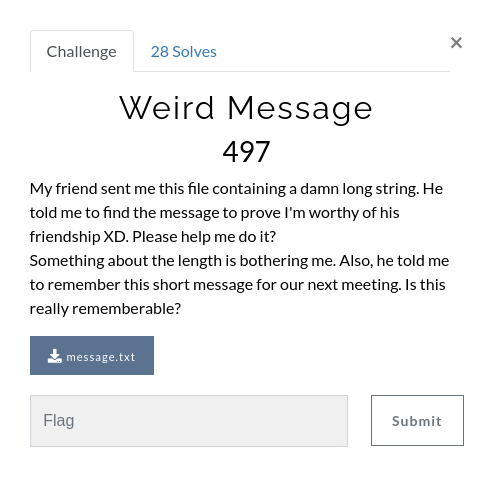
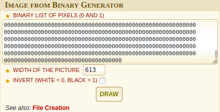

## Solution

 The author says that something about the length is bothering him. Lets check out the length of the message => 50879
 Trying out stuff with the length shows that the length is a multiplication of 2 Prime Numbers, now that is a not something you would generally find in an encrypted message. They tend to be at least even if not divisible by a higher power of 2. And here we have this message of a length divisible only by 2 Primes.
 The problem focusses on these primes, so maybe we have a canvas of 613*83 pixels with the 1's and 0's standing for white and black.
To test this out we find an online tool pretty easily : <a href="https://www.dcode.fr/binary-image">Image from Binary Generator</a>

Putting in our Binary message and the width as 613(The width is probably longer that height, so we try that first), and get the following image.

 Looking at this image we can be sure we are pretty close to the flag as we can make out that there's some text but cant exactly read it.
We can make out "vishwaCTF{" at the start of the image, but there's also a "{" at the start as well.
 Most probably, half of the image is mirrored.
 So, we can write a <a href="snake.py">Script</a>
 The result of running which is copied into <a href="snakefinal.txt">snakefinal.txt</a>

 Entering the new text in the earlier tool gives us the flag image as follows.
