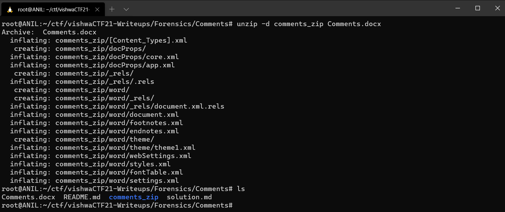
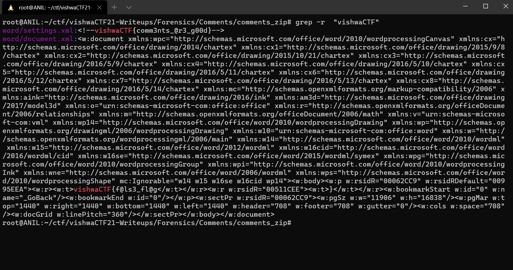

## Solution

A .docx file is a **compressed** archive.

So first we need to unzip it using **unzip -d comments_zip Comments.docx**.

 

Using grep we can find the flag **grep -r "vishwaCTF"** .

Then we get our flag **vishwaCTF{comm3nts_@r3_g00d}**

 

