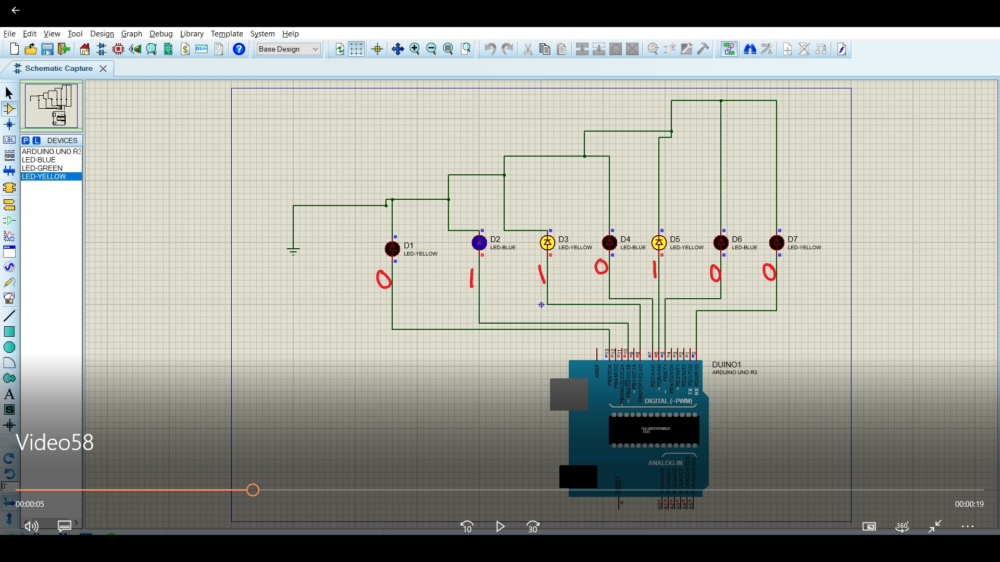
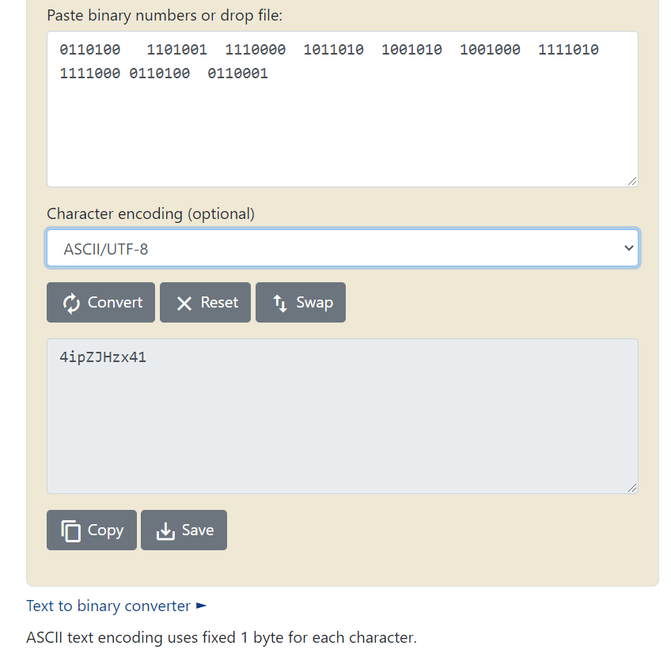
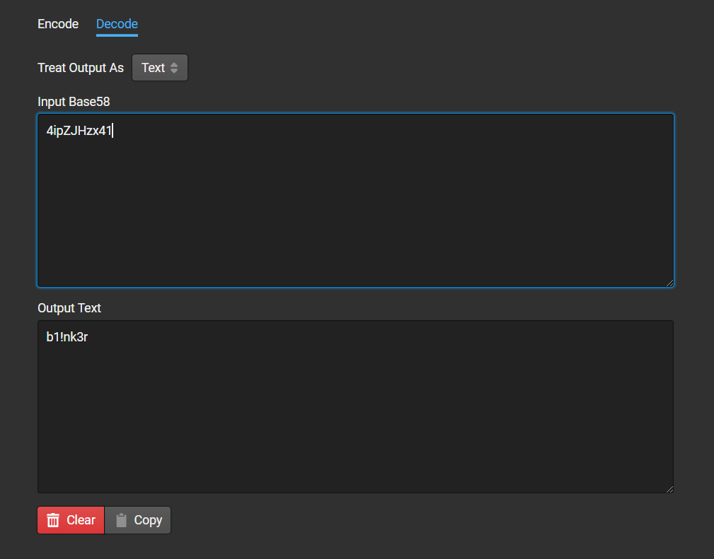

## Solution

In video there are 7 leds blinking .

Each Led represents a bit.When led glow consider it as **1** else as **0**

 


We get following bits : 

```c++
0110100
1101001
1110000
1011010
1001010
1001000
1111010
1111000
0110100
0110001
```

As the description suggests   **American Standard Code for Information Interchange** , which is the full form for **ASCII** converting those bits to text we get **4ipZJHzx41**

 

Now , name of video is **Video58** which hints towards Base58.
So decoding that using base58 we get our flag  **b1!nk3r** .

 
