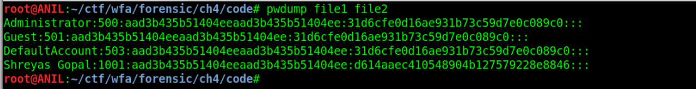
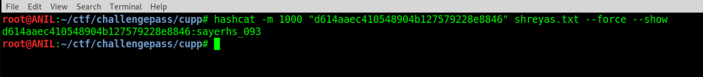

## Solution

This challenge is a follow up challenge for Remember .

The files given are same as previous challenge.


Using **pwdump** we can get NTLM hash **d614aaec410548904b127579228e8846** for the user Shreyas Gopal


 


To brute force this hash  ,  create a wordlist using **cupp**.


While using cupp  , enter the info exactly given in the description.

The description tells us that Shreyas was exactly 20 yrs old when password was changed .This tells his birthdate which is 
**10/01/1993 (dd/mm/yyyy)** . 

```c
root@ANIL:~/ctf/challengepass/cupp# python3 cupp.py -i
 ___________ 
   cupp.py!                 # Common
      \                     # User
       \   ,__,             # Passwords
        \  (oo)____         # Profiler
           (__)    )\   
              ||--|| *      [ Muris Kurgas | j0rgan@remote-exploit.org ]
                            [ Mebus | https://github.com/Mebus/]


[+] Insert the information about the victim to make a dictionary
[+] If you don't know all the info, just hit enter when asked! ;)

> First Name: shreyas
> Surname: gopal
> Nickname: savvy
> Birthdate (DDMMYYYY): 10011993


> Partners) name: 
> Partners) nickname: 
> Partners) birthdate (DDMMYYYY): 


> Child's name: 
> Child's nickname: 
> Child's birthdate (DDMMYYYY): 


> Pet's name: 
> Company name: 


> Do you want to add some key words about the victim? Y/[N]: n
> Do you want to add special chars at the end of words? Y/[N]: y
> Do you want to add some random numbers at the end of words? Y/[N]:y
> Leet mode? (i.e. leet = 1337) Y/[N]: n

[+] Now making a dictionary...
[+] Sorting list and removing duplicates...
[+] Saving dictionary to shreyas.txt, counting 6206 words.
> Hyperspeed Print? (Y/n) : n
[+] Now load your pistolero with shreyas.txt and shoot! Good luck!

```

Using **hashcat** and the wordlist we get our password : **sayerhs_093** , which is the flag.

-m for NTLM hash mode

 


