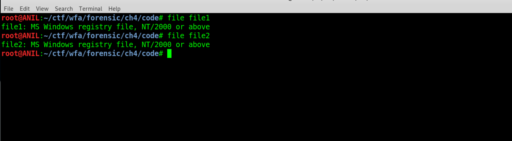
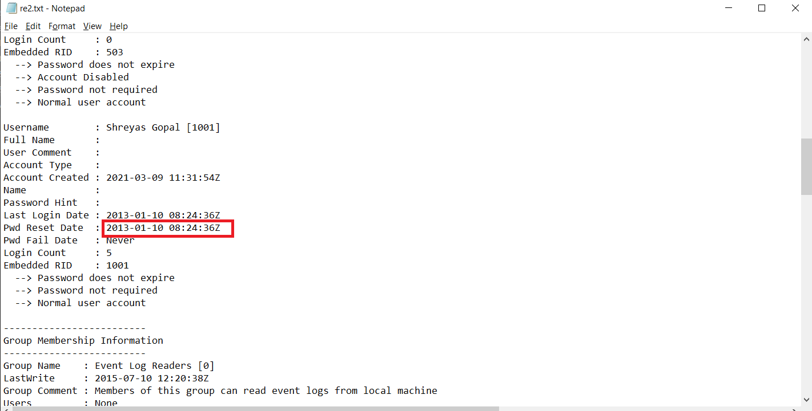

## Solution

Doing file analysis on files **file1** **file2** we get to know that the files are windows registry files .

 

Using **RegRipper** we can extract the last password change date from **file2** provided.

 

Now writing in the given format **thursday_january_10_08_24_36_2013** we get the flag