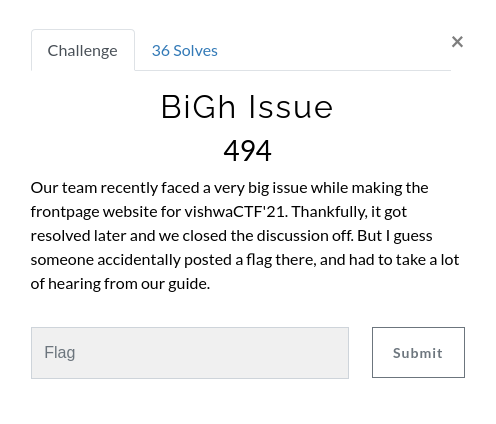
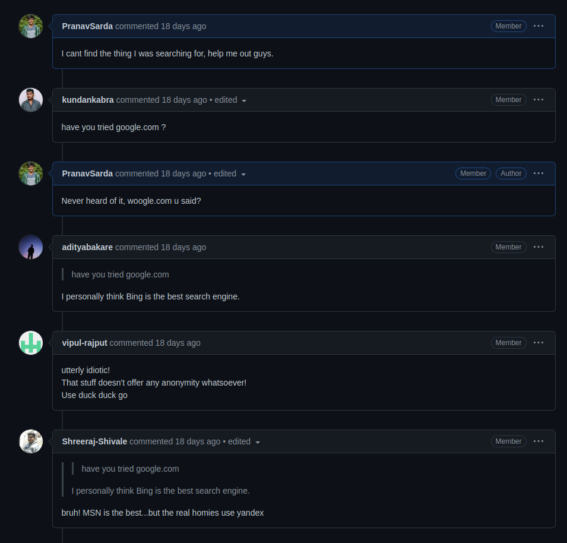

## Solution

 We find the Github Repository for the website as the problem says its being built by a team, and teams generally collaborate over Github.
 Next we need to head over to the Issues of the Repo and check the "Closed Issues".

 We find the Issue #28 as <a href="https://github.com/CybercellVIIT/vishwaCTFWebsite21/issues/28">"Huge Issue : Very big Problem. Urgent Help Needed!"</a>, seems like a made up issue describing nothing. Suspicious.

 The Discussion of the Issue is pretty trolly. The flag's surely on this issue, or at least a hint leading to it.
 The Discussion's closed off, but the flag's in none of the comments made. But the last comment surely mentions "Found 'it' here.". We need to dig a bit more.
 We see that the last comment before the user closes the Issue is edited. Opening it up gives us the flag in the comment history as follows : 
