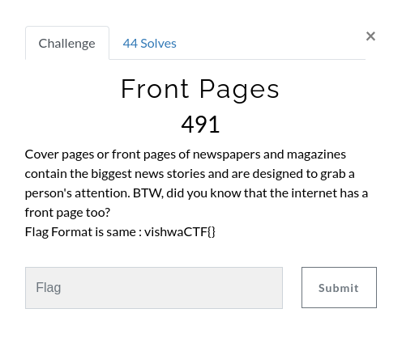
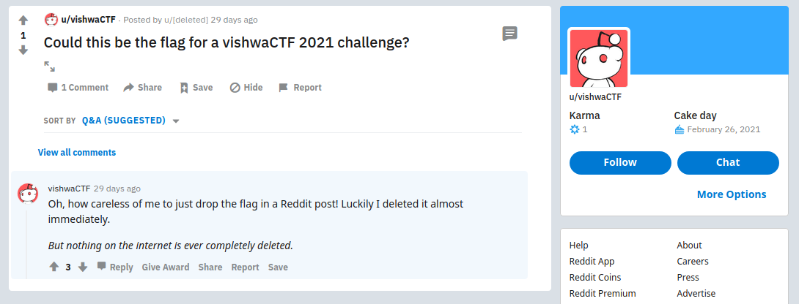
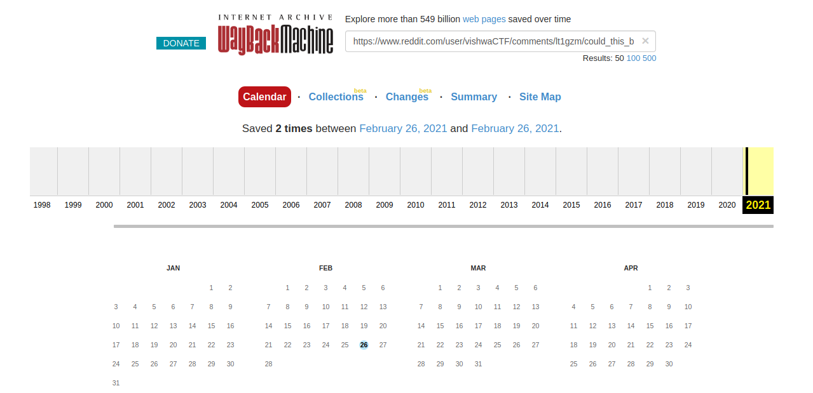
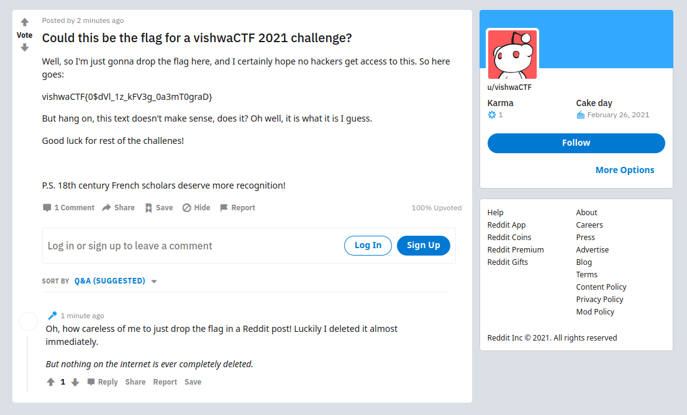

## Solution

 Searching for the Front Page of the Internet leads us to Reddit. And, searching for vishwaCTF on Reddit leads us to a user u/vishwaCTF, but the user has a blank profile without any posts. Lets check the comments, and sure enough we find just one comment stating that the user accidentally posted a flag on Reddit.

 Opening the comment however shows that the post has been deleted.

 But the comment also says that nothing on the Internet is ever deleted, so we just need to know how. This leads us to the <a href="https://archive.org/web/">WayBackMachine</a>.

 Here we try putting the link of the post and see that there's 2 snapshots that have been recorded for the given link on 26 Feb 2021.

 Opening the first one shows the contents of the post before it was deleted as follows:

 We see that the post has the flag in vishwaCTF{} format, but the test inside doesnt make any sense.

 However, there's a P.S. at the end of the post saying that 18th Century Scholars deserve more recognition. Searching for 18th Century Scholars in Cryptography gives us "Blaise de Vigenère".

 So we try to decode the message using <a href="https://cryptii.com/">Cryptii</a>'s Vignere Cipher Decoder. But, this needs a key.

 Trying the first most probable key of "vishwaCTF" we get the inner text as : {0$iNt_1s_oFT3n_0v3rL0okeD}