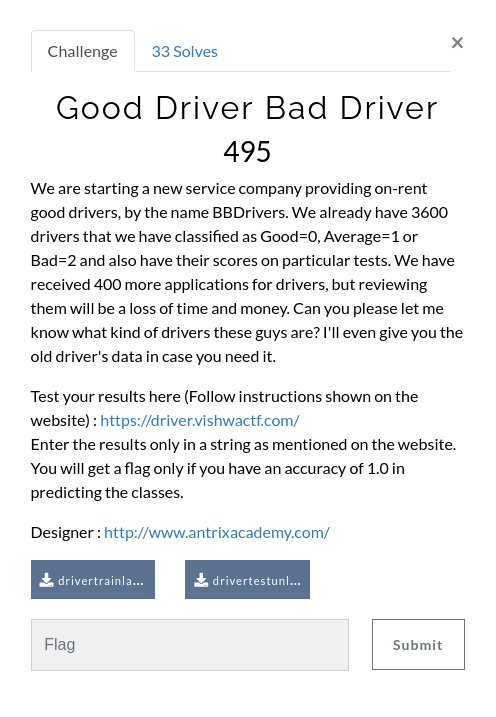
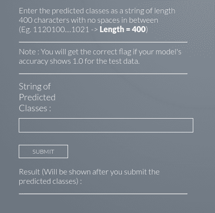
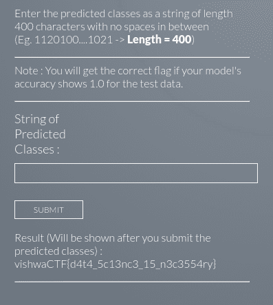

## Solution

  We are given two datasets :- <ul><li><a href="drivertrainlabeled.csv">drivertrainlabeled.csv</a></li><li><a href="drivertestunlabeled.csv">drivertestunlabeled.csv</a></li></ul>

 For solving the problem, we need to design a Machine Learning Model that will predict the driver class in the test data, with an accuracy of 1. An accuracy of 1 is uncommon, but lets see.

 We can just start with some inbuilt Scikit-Learn Model.
 Using the KNN Classifier we do get a 1.0 accuracy on the train data at least. So, we go ahead and use the model to predict the Test Driver Data Classes and get a string as :
 1110111111011011010011121101111111111111011101100111001101110011111111101011101011111111100011110100110111111111110111111111101111111101111111111100111001010111112101111110111110111100111111111111111110100110100111111012110100111111111111111121011111111101111111111110111112111101111111111111111101111110011210111001111011100121111111111111111011111121111111101111111111111111110110111110111011102111

 Putting the above string in the given field, we get the flag as output.

