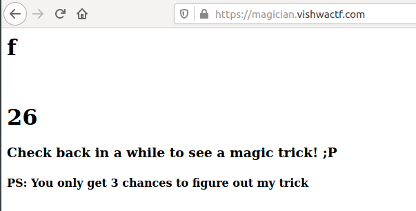

## Solution

 Going onto the link given in description, we should be able to see the following page.

 Checking back after some while(20 minutes) we will see a slight change in the page as shown below.

 Basically, the number went from 25->26 and the text above it change from 1->f. So, the number might actually be the String Array Index. And the character above itmust be the actual character in the Flag String.

 So we just need to build a background script to fetch the page after every 20 mins. Or we can just make a script to log into some file and run it in every 20 mins with a Cronjob on Linux or a Task Scheduler in Windows, and then read the flag from the log. 
 3 chances must mean that the flag cycles back in every 12 hours as the vishwaCTF'21 was 36 hours long.