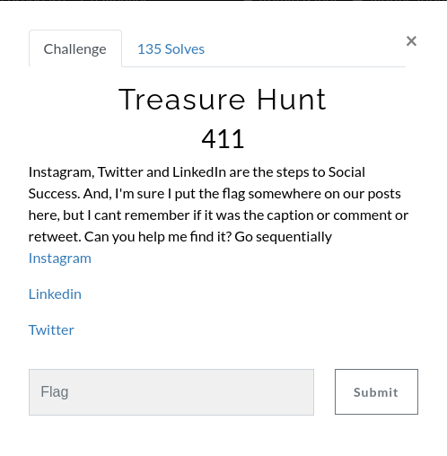
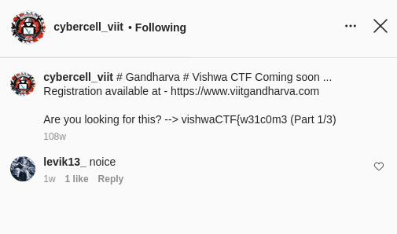
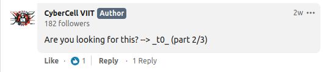
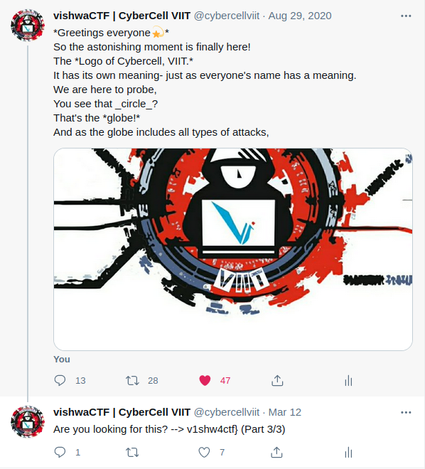
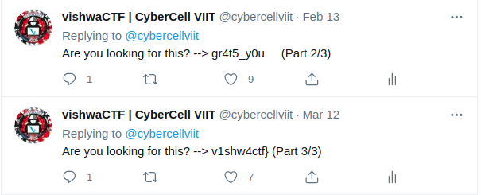

## Solution

 We can just follow the links for the social media handles given.
 <a href="https://www.instagram.com/cybercell_viit/">Instagram</a>
 <a href="https://in.linkedin.com/company/cybercell-viit">LinkedIn</a>
 <a href="https://twitter.com/cybercellviit?lang=en">Twitter</a>

 We get the first part in caption of the oldest post on Instagram : https://www.instagram.com/p/BuY2bhkhboO/?utm_source=ig_web_copy_link

 We get the second part in comments of the oldest post on LinkedIn : https://www.linkedin.com/feed/update/urn:li:activity:6705436186833387521

 We get the third part in a reply tweet to the oldest tweet on Twitter : https://twitter.com/cybercellviit/status/1299671113039970305

 Although there's also a diversion on Twitter from the vishwaCTF-Mini from February 13th ;P