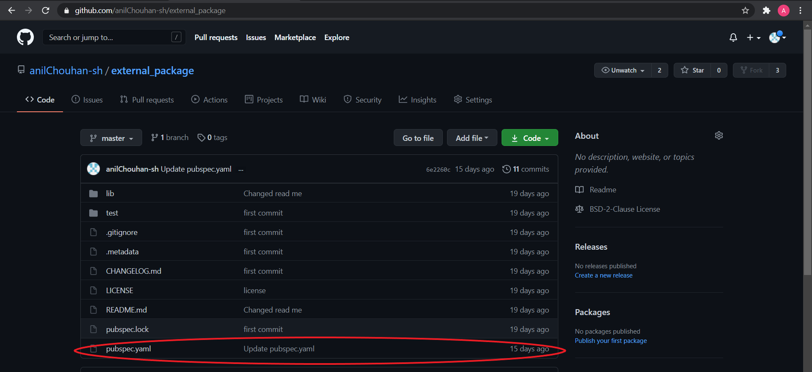

## Solution

The description hints for flutter app and says to go through movie list


 


In the list there is a item named **external_package** . The name itself hints for some kind of external packages which are often used in flutter app

Also the name of the challenge is **pub**.There is a website called **pub.dev** where flutter packages are published.
Searching **external_package** on **pub.dev** would give you this :

 


 


The package description says **vishwaCTF flag**. 
Visiting the source code for package on github , shows a commit **Update pubspec.yaml** which is recently updated.


 


In the file **pubspec.yaml** there is a comment which states :

```c
pubpubpubspec pubpub pubpubpub pubpubpubpub pubspecspec pubspec specpubspecpub spec pubpubspecpub{pubpubspec pubpubpub pubpubpubspecspec pubpubspecpub pubpubspec pubspecspecspecspec pubpubspecspecpubspec pubpubspecpub pubspecspecspecspec pubpubspec spec spec pubpubpubspecspec pubspecpub pubpubspecspecpubspec pubspecspecpub pubspecspecpubspecpub specpubspecpub specpubspec pubspec specspecpub pub}
```


 


This is a morse code where **short** is **pub** and long is **spec**.Removing **{ }** and decrypting the morse code will give you 

**vishwactfus3fu1_f1utt3r_p@ckage** .Adding brackets back will give the flag **vishwactf{us3fu1_f1utt3r_p@ckage}**


 


