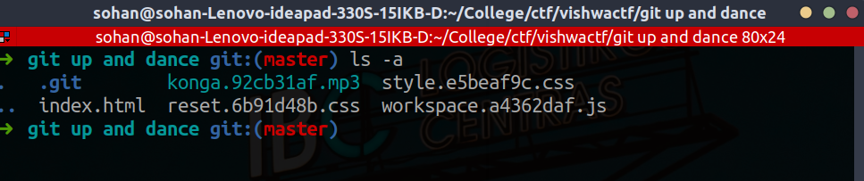
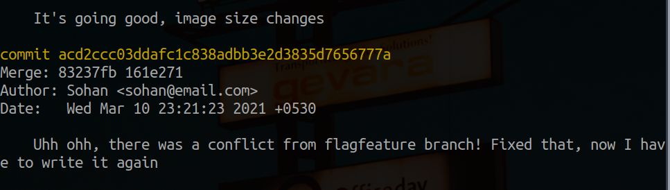
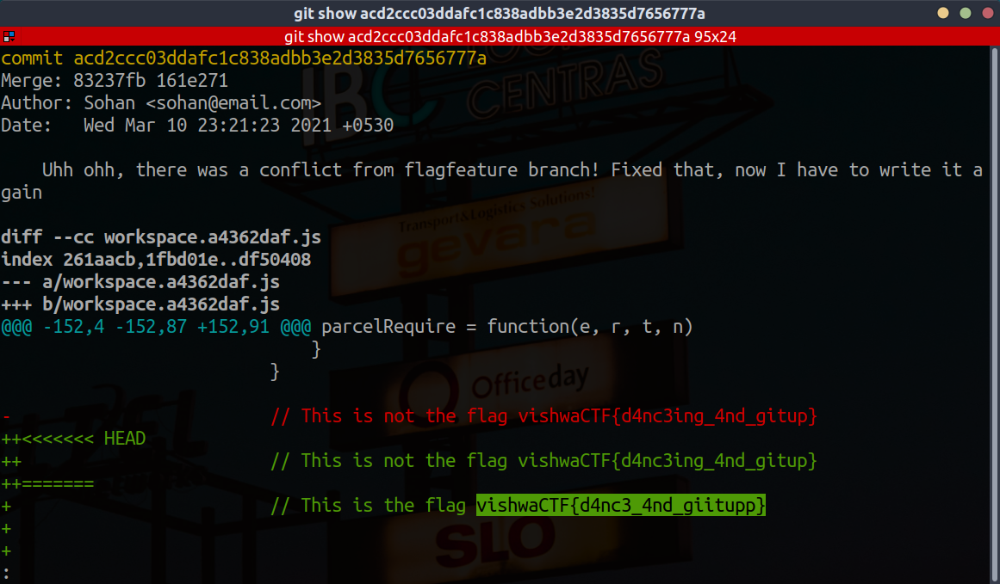

## Magician

Author : <a href="https://github.com/skohan">Sohan</a>

Title : Git Up and Dance

Category : General 

Scoring : dynamic

Points : 480

Description : You gotta git up and maybe dance a little back and forth to get the desired result.

Flags : vishwaCTF{d4nc3_4nd_giitupp}

Files : Zip file given

Hints : None

Solves : 61


## Solution

Once you unzip the given file and cd into it, after running 
```ls -a```

You'll see a ``.git`` repository 


 

There is comment saying it is not a flag in ```workspace.a4362daf.js``` file, and indeed it was not the flag.

```git logs``` gives history of commits done. After analysing them we see one commit which is intersting.


 

Copying the commit hash and running through ```git show``` will spill the flag.

 