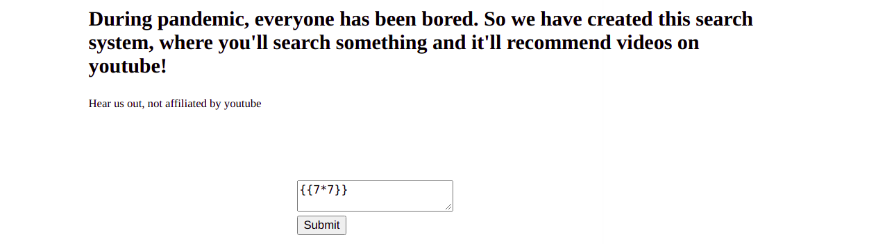

## Magician

Author : druagssa

Title : My Awesome Youtube recommendation

Category : Web

Scoring : dynamic

Points : 485

Description : Hey there, I made my first Flask app which recommends youtube videos for your search. Hope you like it.
https://yt-search.vishwactf.com/

Flags : vishwaCTF{th3_f14g_ln_c0nflg}

Files : None

Hints : None

Solves : 48

## Solution

As the description says, it uses flask as backend. Flask has vulnerability with Jinja2 template it uses for rendering html template, which might be prone to Server Side Template Injection.


Giving value of {{7*7}} evaluates to 49, that means it has server side template injection. We can leak out some secret varibles from the server.



Flask app has ```config``` variable which has configurations about the flask app. 
Passing ```{{config}}``` to the input we get


Secret key of the config varible has the flag.

NOTE: The site redirects everytime you pass input to the youtube video, you can use curl or other methods to send request and get response. Request is sent to ```/results?query={{config}}```

