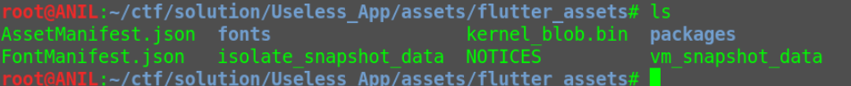
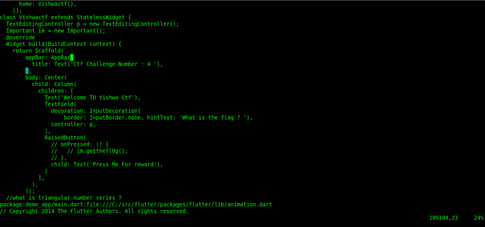
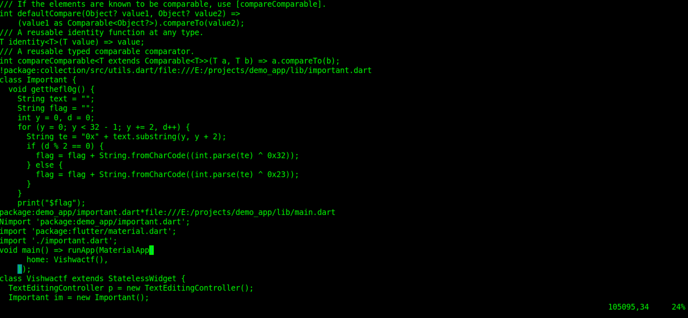
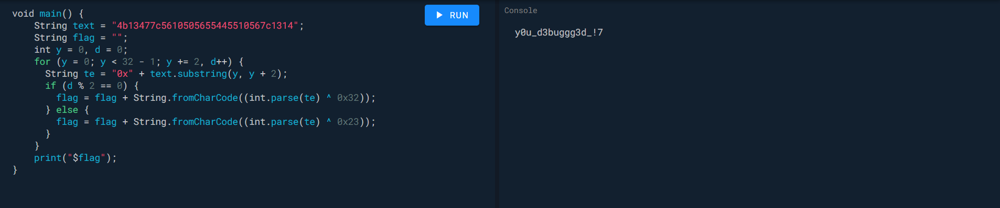

# Useless-App

Author : <a href="https://github.com/anilChouhan-sh">Anil Chouhan</a>

Title : Useless App

Category : Reverse Engineering

Scoring : Dynamic

Points : 500

Description : Sometimes you place some unprocessed string at wrong place which makes it useless

Flags : vishwaCTF{y0u_d3buggg3d_!7}

Files : apk is given

Hints : None

Solves : 1

## Solution

The given apk is a debug apk

Decompile it with jadx or apktool.


In assets directory there is a directory named Futter assests. which points that the app is build using FLutter


For a flutter debug_app the app source code is available in __kernel_blob.in__ which is available in flutter assets.


 


After extracting the strings available using __strings kernel_blob.in__   and finding main.dart file code ( which is the entry point for a flutter app ) in kernel_blob.in
There is a function call __im.getthefl0g()__ which is commented 
Also there is a  comment __//what is triangular series?__


 


Going to the function call   shows that it prints out the flag.
Also it is missing contents of variable text.
The function has a for loop which loops for y=0 to y=30 i.e 31 times but inside loop y+1 is considered hence a __string length of 32__ is required.
The functions prepends __0x__ to a group of 2 char which tells that those 2 chars are hex.


 


The missing string was there in the res/values/strings.xml but it had a string_name whose length was more than required.
To reduce this  ,  keeping  first 32 terms of triangular series as indexes for string_name would give a string  of length 32
Here's a  python script for that :

```python
x = "4b616e316e404467796c67207265c065617455646c792673616964217468617420086f6c6d65735077617320696073706972656425627920746865206265616c2d6c69665520666967757265256f66204a6f736570642042656c6c2c20612043757267656f6e2061745074686520526f79616c25496e6669726d617279206166204564696e62757267680c2077686f6d20436f6e616e50446f796c65206d6574206966203138373720616e642068616720776f726b656420666f722061c3206120636c65726b2e204c696b1520486f6c6d65732c2042656c6c23776173206e6f74656420666f722061726177696e672062726f616420636f4e636c7573696f6e732066726f6d206d696e757465206f62736572766174696f6e732e5b31325d20486f77657665722c206865206c617465722077726f746520746f20436f6e616e20446f796c653a2022596f752061726520796f757273656c6620536865726c6f636b20486f6c6d657320616e642077656c6c20796f75206b6e6f77206974222e5b31335d205369722048656e7279204c6974746c656a6f686e2c204368616972206f66204d65646963616c204a7572697370727564656e63652061742074686520556e6976657273697479206f66204564696e6275726768204d65646963616c205363686f6f6c2c20697320616c736f20636974656420617320616e20696e737069726174696f6e20666f7220486f6c6d65732e204c6974746c656a6f686e2c2077686f2077617320616c736f20506f6c6963652053757267656f6e20616e64204d65646963616c204f666669636572206f66204865616c746820696e204564696e62757267682c2070726f766964656420436f6e616e20446f796c6520776974682061206c696e6b206265747765656e206d65646963616c20696e7665737469676174696f6e20616e642074686520646574656374696f6e206f66206372696d652e"
ans = ""

for i in range(0 , 32) :
    d = (i*(i+1))//2
    ans = ans + x[d]
    
print(ans)
```


Putting the extracted string in the gettheflag function would give  "y0u_d3buggg3d_!7" which is the flag.

```dart
  void getthefl0g() {
    String text = "4b13477c5610505655445510567c1314";
    String flag = "";
    int y = 0, d = 0;
    for (y = 0; y < 32 - 1; y += 2, d++) {
      String te = "0x" + text.substring(y, y + 2);
      if (d % 2 == 0) {
        flag = flag + String.fromCharCode((int.parse(te) ^ 0x32));
      } else {
        flag = flag + String.fromCharCode((int.parse(te) ^ 0x23));
      }
    } 
    print("$flag");
}
```



