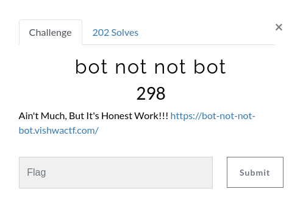
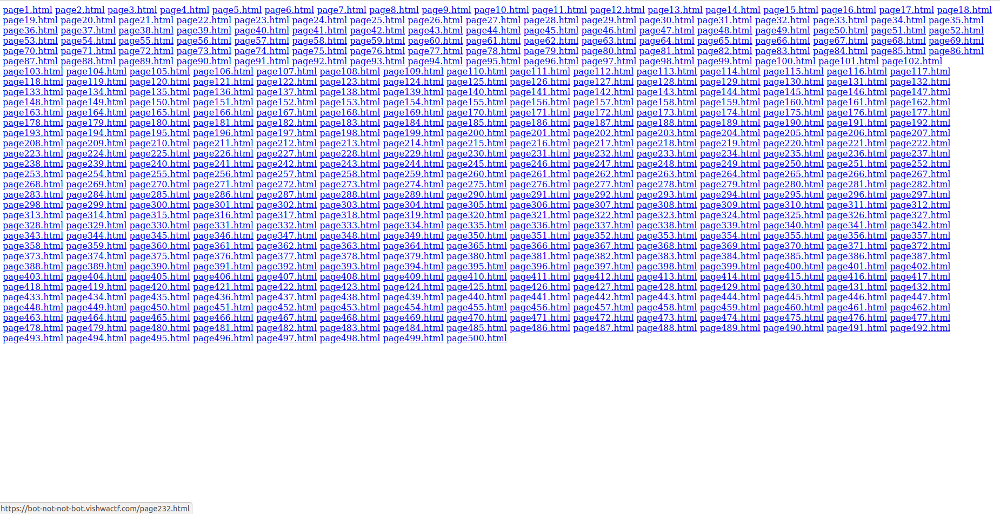
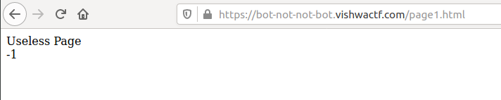
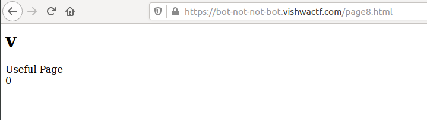
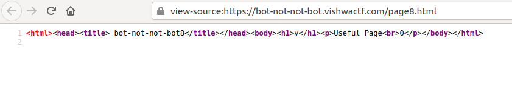

## Solution

Going on the link shown in description, we get the below Page.

Opening the first link here, we see the following page.

We sse that its written "Useless Page" here and also a number -1.

Reaching Page 8 we find the first useful page as shown above. It has a "v" in a big font, "Useful Page" below it. And 0 after that.
Wait, vishwaCTF{whatever_flag_it_may_be} starts with a "v". Maybe the 0 stands for array-like index of the flag string?
To test this we will have to make a Scraper to scrape all the pages and see whats in the "Useful Pages"

Just to make sure, we can check there's nothing more in the Page Source to hide. We see that we only need to extract the <b>h1</b> and <b>p</b> tags.

So, we can write a Python Script directly similar to <a href="./solution.py">this.</a>